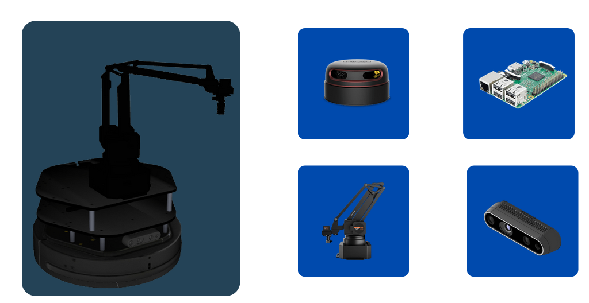
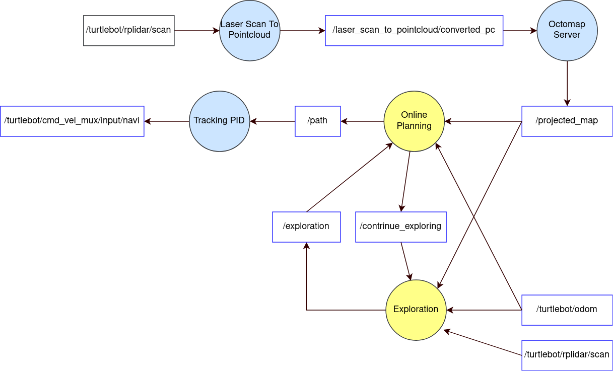

# Task Priority Control for a Mobile Manipulator 

**This project belongs to the Universitat de Girona. It is forbidden to publish this project or any derivative work in any public repository.**

Prototype and main components:

<p align="center">

</p>
<figcaption align="center"><b>Figure 1. Turtlebot 2: Robotic Platform for Testing the Algorithm</b></figcaption>
</figure>

The present package provides the implementation of the Task Priority Control Algorithm on a mobile manipulator for pick and place applications using Aruco markers to know the position of the object to pick. The whole implementation takes place in ROS Noetic and the custom nodes were written in Python3 using the NumPy library for matrix operations.

<p align="center">


</p>
<figcaption align="center"><b>Figure 2. Task Priority Control Pseudo Code and Robot's schematic considering each DoF</b></figcaption>
</figure>

## Team Members:

This project has been carried out by:

* [](https://www.github.com/enriquea52) [Enrique Aleman]
* [Mohammad Alshimmari]


## Code Structure
```bash
├── CMakeLists.txt
├── config
│   └── parameters.yaml
├── docs
│   └── imgs
│       ├── aruco_sim.png
│       ├── aruco_vis.png
│       ├── dof_diagram.png
│       ├── pseudo.png
│       ├── software.png
│       └── turtlebot_hardware.png
├── launch
│   ├── intrevention.launch
│   └── simulation.launch
├── package.xml
├── README.md
└── scripts
    ├── aruco_detector.py
    ├── mobile_control_v2.py
    ├── mobile_tasks.py
    └── task_monitor.py

```

## Required Packages

To make use of the present package, it is necessary to have the following packages and dependencies installed or install them by running the following commands in the working ROS workspace.

For the real platform
```bash

# Clone required packages
cd ~/catkin_ws/src
git clone https://bitbucket.org/udg_cirs/turtlebot.git # This repository!
git clone https://bitbucket.org/udg_cirs/turtlebot_description.git

#The kobuki mobile base
git clone https://bitbucket.org/udg_cirs/kobuki.git
git clone https://bitbucket.org/udg_cirs/kobuki_description.git
git clone https://bitbucket.org/udg_cirs/yujin_ocs.git

# The manipulator
git clone https://bitbucket.org/udg_cirs/swiftpro.git
git clone https://bitbucket.org/udg_cirs/swiftpro_description.git

# The Lidar
git clone https://github.com/Slamtec/rplidar_ros.git
```

For the simulated environment

```bash
# Clone required packages
cd ~/catkin_ws/src
git clone https://bitbucket.org/udg_cirs/turtlebot_desktop.git 
git clone https://bitbucket.org/udg_cirs/turtlebot_description.git 

#The kobuki mobile base
git clone https://bitbucket.org/udg_cirs/kobuki_desktop.git
git clone https://bitbucket.org/udg_cirs/kobuki_description.git

# The manipulator
git clone https://bitbucket.org/udg_cirs/swiftpro_desktop.git
git clone https://bitbucket.org/udg_cirs/swiftpro_description.git

# The simulation world
git clone https://bitbucket.org/udg_cirs/small_house_world.git 

# Kobuki mobile base dependencies
git clone https://bitbucket.org/udg_cirs/yujin_ocs.git

# ROS controllers
sudo apt install ros-noetic-ros-control                     
sudo apt install ros-noetic-ros-controllers

# Install xterm terminal emulator
sudo apt-get install -y xterm 

# Project Specic Requirements: 

# Install octomap server
sudo apt-get install ros-noetic-octomap

# Tracking PID Controller Package
git clone https://github.com/nobleo/tracking_pid.git

# ROS supoort for PyBind11
sudo apt-get install ros-noetic-pybind11-catkin

# Fast Frontier Detection Algorithm custom C++ binder for Python using PyBind11
git clone https://github.com/enriquea52/Fast-Frontier-Detector.git

# Fast Frontier Detection Algorithm custom C++ binder for Python PyBind11
git clone https://github.com/enriquea52/rrt_dubins.git

```


## How to use it:

Go to your ROS_workspace/src directory

```bash
  $ cd ~/ROS_workspace/src
```

Clone the project or extact the compressed file in ROS_workspace/src directory 

```bash
  $ git clone https://github.com/enriquea52/Hands-On-Intervention
```

Go back to ROS_workspace directory

```bash
  $ cd ../
```

Run catkin_make or catkin build

```bash
  $ catkin_make
  $ source ./devel/setup.bash 
```
The package can be run either for a real platform or for a simulated environment, the following are the comands for each case.

* Real Platform
```bash
  $ roslaunch intervention intervention.launch tbot_name:=turtlebotX
```
Where X can be either 1, 2 or 3
* Simulated Environment

```bash
  $ roslaunch intervention simulation.launch
```

## Software Architecture

<p align="center">

</p>
<figcaption align="center"><b>Figure 3. ROS software architecture</b></figcaption>
</figure>

## Video demosntrations (Click on video):

<p float="left">

Task Priotrity Control To Pick an Aruco (Simulation)

[](https://youtu.be/RIYBSQnRryc)

Task Priotrity Control To Pick an Aruco (Real System)

[](https://youtu.be/ZnocUXVv37o)

</p>


