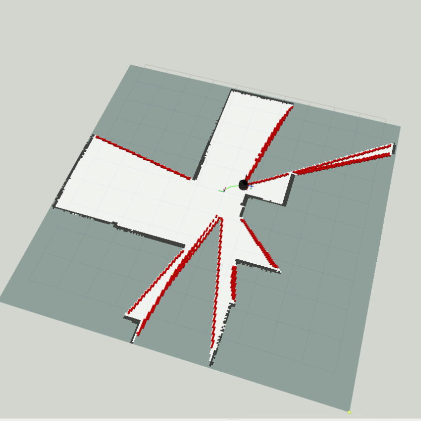

# Towards 2D Indoor Mapping, A Hybrid Exploration Algorithm 


Prototype and main components:

<p align="center">

</p>
<figcaption align="center"><b>Figure 1. Turtlebot 2: Robotic Platform for Testing the Algorithm</b></figcaption>
</figure>

The present package presents the final project for the Hands On Planning course which is base dn building an exploration algorithm for a differential drive robot equipped with a LiDAR, which in this case is a modified Turtlebo 2 robot as shown in Figure 1. The exploration algorithm uses a hybrid apprach combining Frontier Based Exploration and Sampling Based exploration in order to take the advantages of both of them. The algorithm uses a custom implementation of the RRT* path planning algorithm with the use of Dubins path in order to embed kinematic constraints on the generated path. The final part of the project is a path tracking control algorithm for making the robot follow the generated path, for this purpose, the Tracking PID package was configured and used for achieving the path tracking behavior. Figure 2 shows the turtlebot on an environmet with Frontier and about to move to the Next Best View (NBV).


<p align="center">

</p>
<figcaption align="center"><b>Figure 2.Hybrid based robot exploration for solving the NBV problem</b></figcaption>
</figure>

## Team Members:

This project has been carried out by:

* [](https://www.github.com/enriquea52) [Enrique Aleman]
* [Mohammad Alshimmari]


## Code Structure
```bash
├── CMakeLists.txt
├── config
│   └── parameters.yaml
├── docs
│   └── imgs
│       ├── exploration.png
│       ├── software.png
│       └── turtlebot_hardware.png
├── launch
│   ├── octomap.launch
│   └── simulation.launch
├── map.bt
├── package.xml
├── README.md
└── scripts
    ├── exploration_node.py
    ├── laser_scan_to_point_cloud.py
    ├── online_planning_node.py
    └── utils_lib
        ├── bresenham.py
        ├── exploration.py
        ├── __init__.py
        └── safe_planning.py
```

## Required Packages

To make use of the present package, it is necessary to have the following packages and dependencies installed or install them by running the following commands in the working ROS workspace.

For the real platform
```bash

# Clone required packages
cd ~/catkin_ws/src
git clone https://bitbucket.org/udg_cirs/turtlebot.git # This repository!
git clone https://bitbucket.org/udg_cirs/turtlebot_description.git

#The kobuki mobile base
git clone https://bitbucket.org/udg_cirs/kobuki.git
git clone https://bitbucket.org/udg_cirs/kobuki_description.git
git clone https://bitbucket.org/udg_cirs/yujin_ocs.git

# The manipulator
git clone https://bitbucket.org/udg_cirs/swiftpro.git
git clone https://bitbucket.org/udg_cirs/swiftpro_description.git

# The Lidar
git clone https://github.com/Slamtec/rplidar_ros.git
```

For the simulated environment

```bash
# Clone required packages
cd ~/catkin_ws/src
git clone https://bitbucket.org/udg_cirs/turtlebot_desktop.git 
git clone https://bitbucket.org/udg_cirs/turtlebot_description.git 

#The kobuki mobile base
git clone https://bitbucket.org/udg_cirs/kobuki_desktop.git
git clone https://bitbucket.org/udg_cirs/kobuki_description.git

# The manipulator
git clone https://bitbucket.org/udg_cirs/swiftpro_desktop.git
git clone https://bitbucket.org/udg_cirs/swiftpro_description.git

# The simulation world
git clone https://bitbucket.org/udg_cirs/small_house_world.git 

# Kobuki mobile base dependencies
git clone https://bitbucket.org/udg_cirs/yujin_ocs.git

# ROS controllers
sudo apt install ros-noetic-ros-control                     
sudo apt install ros-noetic-ros-controllers

# Install xterm terminal emulator
sudo apt-get install -y xterm 

# ***** Project Specic Requirements: *****

# Install octomap server
sudo apt-get install ros-noetic-octomap

# Tracking PID Controller Package
git clone https://github.com/nobleo/tracking_pid.git

# ROS supoort for PyBind11
sudo apt-get install ros-noetic-pybind11-catkin

# Fast Frontier Detection Algorithm custom C++ binder for Python using PyBind11
git clone https://github.com/enriquea52/Fast-Frontier-Detector.git

# Fast Frontier Detection Algorithm custom C++ binder for Python PyBind11
git clone https://github.com/enriquea52/rrt_dubins.git

```

## How to use it:

Go to your ROS_workspace/src directory

```bash
  $ cd ~/ROS_workspace/src
```

Clone the project or extact the compressed file in ROS_workspace/src directory 

```bash
  $ git clone https://github.com/enriquea52/Hands-On-Planning
```

Go back to ROS_workspace directory

```bash
  $ cd ../
```

Run catkin_make or catkin build

```bash
  $ catkin_make
  $ source ./devel/setup.bash 
```
The package can be run either for a real platform or for a simulated environment, the following are the comands for each case.

* Real Platform
```bash
  $ roslaunch planning planning.launch tbot_name:=turtlebotX
```
Where X can be either 1, 2 or 3
* Simulated Environment

```bash
  $ roslaunch planning simulation.launch
```

## Software Architecture

<p align="center">

</p>
<figcaption align="center"><b>Figure 3. ROS software architecture</b></figcaption>
</figure>

## Video demonstrations (Click on video):

<p float="left">

Robot Exploration (Simulation)

[](https://youtu.be/mjnNn-cA8e4)

Robot Exploration  (Real System)

[](https://youtu.be/1ImR3idGr1s)

</p>


